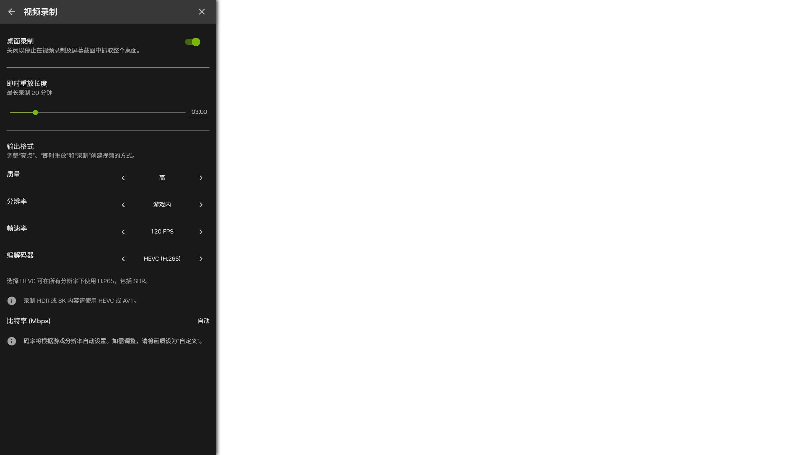

# NVIDIA Codec Split

[English](README.md) · [新版适配流程](docs/ADAPTATION.zh-CN.md) · [验证记录](docs/VALIDATION.md)

将 NVIDIA App 浮窗中的录制编码器拆分为 **H.264、HEVC (H.265)、AV1**，使 **2K SDR** 录制可以直接使用 HEVC，无需选择 4K 或启用 HDR。选项作用于手动录制、即时重放以及共用的视频录制设置。

这是实验性的非官方 Windows 工具。目前仅支持文件哈希匹配的 **NVIDIA App 11.0.9.251**。其他版本会被拒绝，需要重新适配；已验证的硬件为 RTX 4060 Laptop GPU、驱动 616.92。



## 安装

需要 Windows x64、支持 HEVC 录制的 NVIDIA GPU、PATH 中可用的 **64 位 Python 3.11 或更新版本**，以及受支持的 NVIDIA App。Python 可执行文件旁需有 `pythonw.exe`。运行时不需要额外 Python 依赖。

1. 克隆或下载此仓库。
2. 保存正在录制的内容并关闭即时重放。
3. 在普通用户会话运行 **`Apply.cmd`**，允许 Windows UAC 执行安装目录的写入步骤。
4. 打开 NVIDIA 浮窗 → 设置 → 视频录制 → 编解码器，选择 **HEVC (H.265)**。

工具会从本机安装文件生成补丁。原版资源备份、生成物、日志和启动项记录保存在 `%LOCALAPPDATA%\NVIDIA Codec Split`，仓库不包含 NVIDIA DLL、完整界面资源或录制视频。

安装路径不同或需要自定义状态目录时：

```powershell
powershell.exe -NoProfile -File .\Install.ps1 -Action Apply `
  -AppRoot 'C:\Program Files\NVIDIA Corporation\NVIDIA App' `
  -StateDir "$env:LOCALAPPDATA\NVIDIA Codec Split"
```

若已装过此前的本机脚本，先运行 `Restore.cmd`；它可以从旧安装迁移已校验的备份并还原，避免占用相同登录启动项。界面已经打过补丁而本项目没有原始备份时，需通过 `-OriginalFrontend` 提供已核实的原版 `osc` 目录。

## 实现与校验

- 修改浮窗主脚本和语言资源，显示三个独立选项，正确读回 HEVC。仅在硬件支持且后端能力查询成功时列出 HEVC。
- 保留磁盘上的原版签名录制 DLL，由 `pythonw.exe` 登录助手在加载后应用六处内存补丁。
- 每轮扫描检查 DLL 哈希；修改前验证所有目标字节。记录进程创建时间以识别 PID 复用，遇到不支持的版本停止处理。
- 写入时短暂暂停录制进程；发生写入错误时尝试恢复已受影响的区域，再恢复进程运行。
- SDR 下支持范围内的 H.264 尊重显式选择，本次验证了 2K/240 FPS。保留 HDR、8K 和硬件必需的回退；录制 HDR 或 8K 请选 HEVC 或 AV1。

助手仅使用 Python 标准库，不联网、不上传数据。当前用户的登录启动项名为 `NVIDIA Codec Split`，日志在状态目录的 `watcher.log`。

## 检查与还原

```powershell
python .\run.py status
```

`native_original: true` 表示磁盘 DLL 与原版匹配。运行中的录制进程应显示六处 `patched`、零处 `unexpected`。`Check.cmd` 只校验安装文件、生成物和备份。

要撤销，保存正在录制的内容并运行 **`Restore.cmd`**。它先校验所有原版备份，再停止助手、还原界面并重启 NVIDIA 录制服务；管理员步骤成功后才还原登录启动项。公开版助手会正常退出；旧版助手的内存写入子进程会先完成事务，随后才重启服务。已经被新版更新替换的文件会跳过，避免旧备份覆盖新版。完成还原前请保留状态目录；`prepared` 中的生成文件不再是还原的前提。

本项目没有 `manifest.json` 时，会通过旧助手的 `native_manifest.json` 定位原始备份和启动项记录。旧助手目录已删除时，还会查找本仓库旁的 `nvidia_codec_patch` 目录。旧项目在其他位置，或使用了自定义状态目录时：

```powershell
.\Restore.cmd -LegacyRoot 'C:\Backups\nvidia_codec_patch'
.\Restore.cmd -StateDir 'C:\Backups\NVIDIA Codec Split'
```

旧运行时助手使用自定义路径时还需提供 `-LegacyHelper`。原始备份缺失或被修改会在 UAC 前报错，命令返回非零退出码。受支持版本还原后，`python .\run.py status` 应显示六处 `original`、零处 `patched`。`python .\run.py check-restore` 可在不依赖生成文件的情况下只读校验还原来源。

NVIDIA App 更新后可能需要新的版本配置；不能只改哈希或跳过字节检查。完整流程见 [新版适配文档](docs/ADAPTATION.zh-CN.md)。

## 验证与开发

原本机实现的手动录制和即时重放已实测为 **2560×1440、120 FPS、HEVC Main、8 位 SDR**；显式 H.264 的 **2K/240 FPS** 录制保持 H.264 High。公开版的重构校验范围单独记录在 [验证说明](docs/VALIDATION.md)。

```powershell
python -m unittest discover -s tests -v
python -O -m unittest discover -s tests -v
```

CI 在 Windows、Linux 上测试 Python 3.11 和 3.14，使用模拟文件与进程内存，不依赖 GPU、不注入实际 NVIDIA 进程。版本适配可安装可选开发依赖：`pip install -e ".[adaptation]"`。

项目代码和文档采用 [MIT 许可证](LICENSE)。仓库不分发 NVIDIA 软件，NVIDIA 软件与截图中的界面不属于本项目的 MIT 授权范围。本项目与 NVIDIA 无隶属关系。
